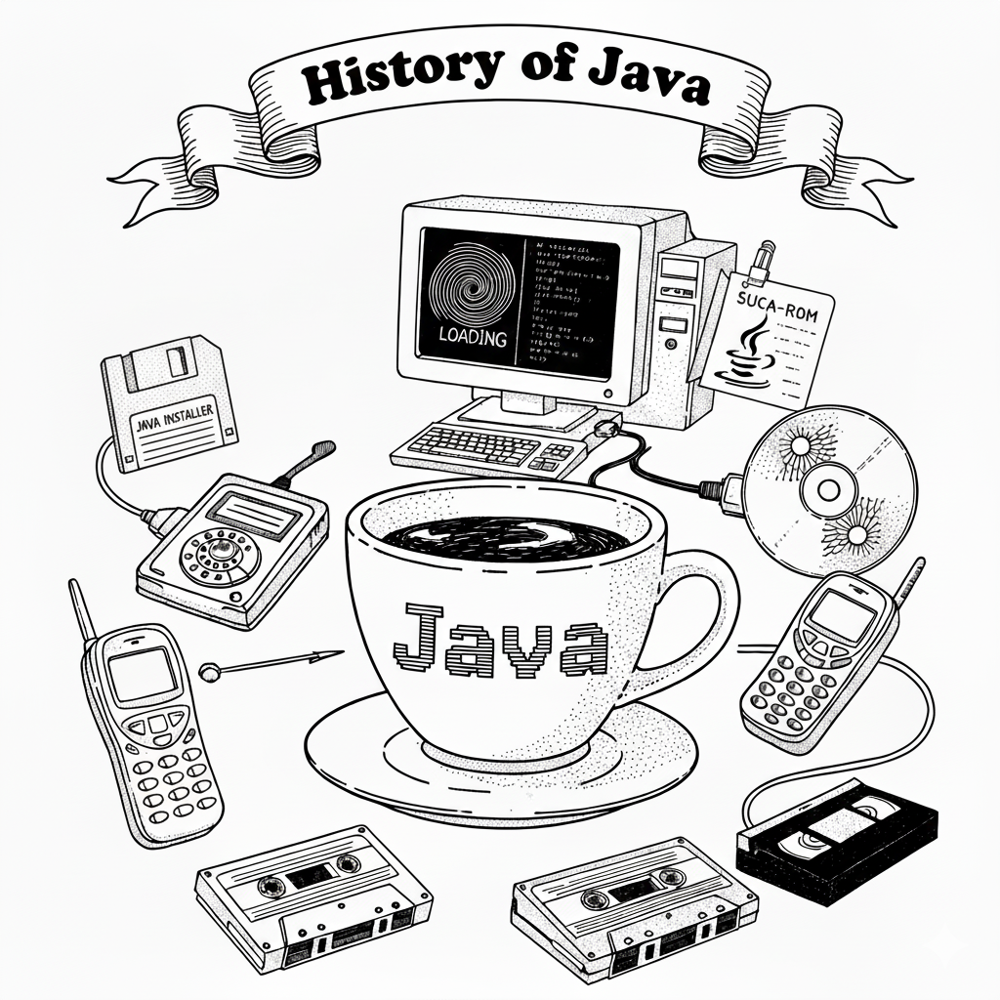
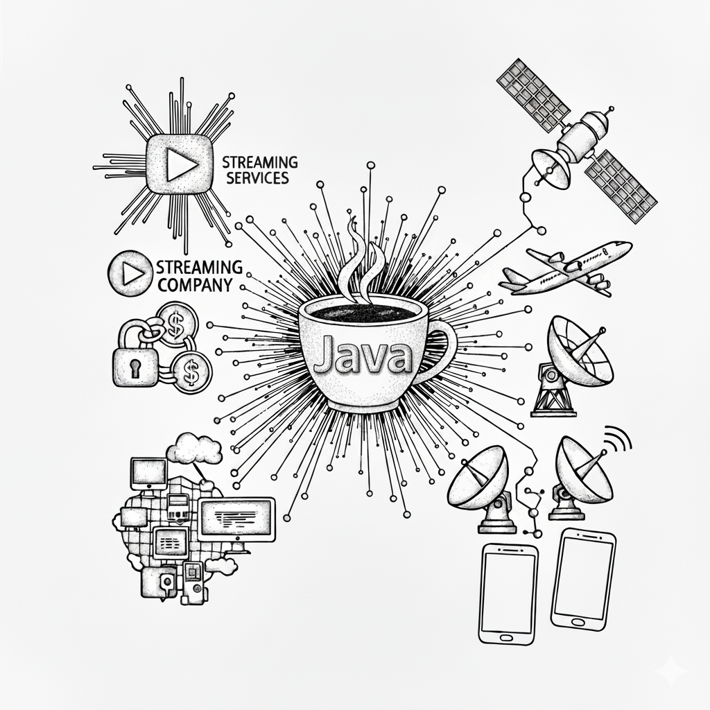
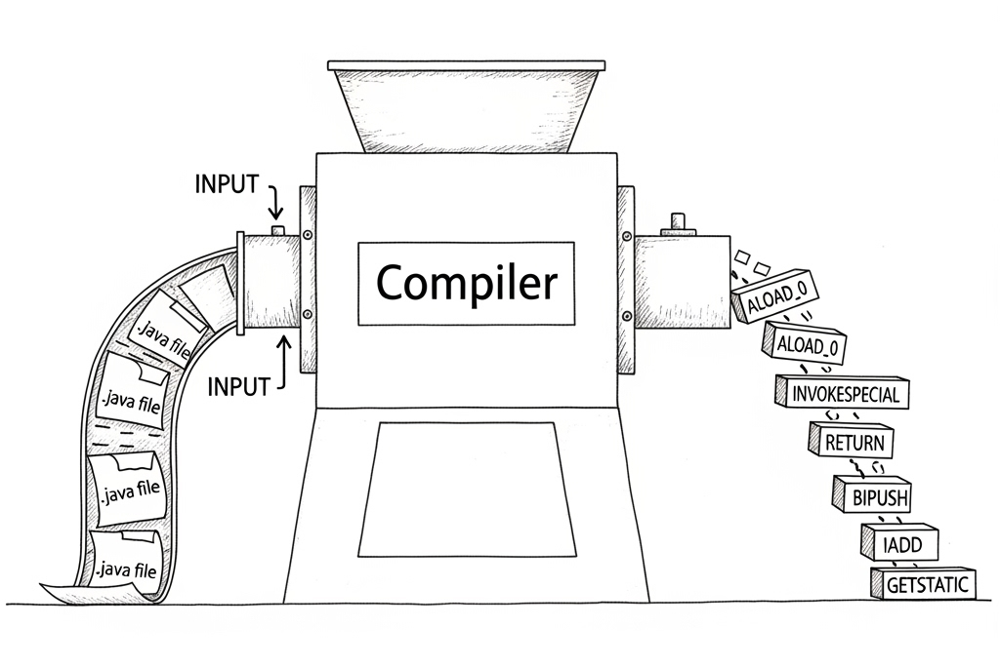
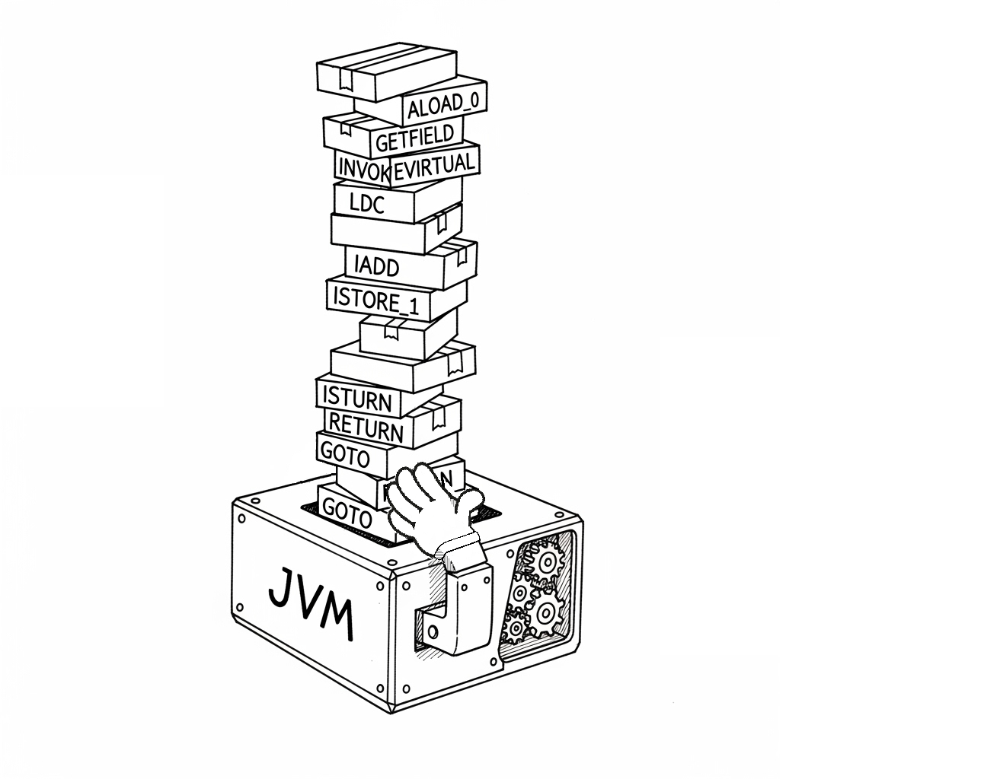

////
Copyright: Eliezer Herrera, 1999-2018
Licencia: Attribution-ShareAlike 4.0 International (CC BY-SA 4.0) https://creativecommons.org/licenses/by-sa/4.0/
////

:chapter: 001
:lang: <<java,Java>>
:jbang: <<jshell,JShell>>
:jshell: <<jshell,JShell>>
:ide: <<ide,IDE>>
:javac: <<javac,javac>>

== Capítulo 1. Introducción.

=== Sobre el libro

Este es un curso para aprender a programar en Java desde cero, orientado a principiantes, asi que no hara falta ningun conocimiento previo para seguirlo.

Muchos otros cursos suponen conocimientos previos, en este curso no sera necesario. Este curso le dara un enfoque de lenguaje de propósito general a Java, tal cual es su naturaleza, alejado de convenciones, frameworks o entornos de desarrollo concretos.

[NOTE]
====
IMPORTANTE: Algunas secciones podrían no estar completamente claras, así que tus comentarios ayudarán a que el libro mejore.
====

=== Cómo usar este libro

Este curso está diseñado para ser leído de manera secuencial, comenzando desde el principio y avanzando capítulo por capítulo. Cada sección introduce nuevos conceptos y construye sobre lo aprendido anteriormente.

En cada capítulo encontrarás ejemplos prácticos y ejercicios para reforzar lo aprendido. Se recomienda intentar resolver los ejercicios por tu cuenta antes de consultar las soluciones. 

// En este curso vamos a aprender {lang} **paso a paso**, usando inicialmente <<jshell,JShell>>, una herramienta que permitira ejecutar codigo Java de manera rapida y sencilla, sin necesidad de configurar un entorno de desarrollo complejo. 

No importa si nunca has programado antes: este libro está diseñado para que **cualquier persona pueda seguirlo desde cero**.

=== Cómo resolver tus dudas
En la última sección del libro podrás encontrar varias formas de contactar conmigo (email, Twitter, mi blog, etc).

=== El lenguaje Java [[java]]
Java es un lenguaje de programación muy popular y versátil, utilizado para crear desde aplicaciones de escritorio hasta aplicaciones móviles y servidores web. Su principal característica es ser **fácil de aprender** para principiantes, a la vez que poderoso para proyectos grandes y complejos.

Al igual que otros lenguajes, Java permite decirle a la computadora **qué hacer paso a paso** mediante instrucciones llamadas *sentencias*. La diferencia de Java es que funciona en cualquier sistema operativo gracias a la tecnología de la Máquina Virtual de Java Virtual Machine*, JVM).

==== Historia de Java

Java fue creado a mediados de los años 90 por James Gosling y su equipo en https://es.wikipedia.org/wiki/Sun_Microsystems[Sun Microsystems]. Originalmente, se diseñó para ser un lenguaje que pudiera ejecutarse en cualquier dispositivo, desde electrodomésticos hasta computadoras. La idea era "escribir una vez, ejecutar en cualquier lugar" (https://en.wikipedia.org/wiki/Write_once,_run_anywhere[*write once, run anywhere*]), lo que significa que el mismo código Java puede funcionar en diferentes sistemas operativos sin modificaciones.

Este principio de portabilidad fue revolucionario en su época, ya que la mayoría de los lenguajes de programación estaban muy ligados a un sistema operativo específico. Para lograr esto, Java utiliza la JVM, que actúa como un intermediario entre el código Java y el sistema operativo.

Esta desicion de crear un lenguaje independiente del sistema operativo fue clave para el éxito de Java, ya que permitió a los desarrolladores crear aplicaciones que podían ejecutarse en cualquier lugar sin preocuparse por las diferencias entre sistemas. Grandes empresas adoptaron Java para sus aplicaciones empresariales, y con el tiempo se convirtió en uno de los lenguajes de programación más utilizados en el mundo.

El lenguaje utiliza una sintaxis similar a otros lenguajes de programación como C y C++, lo que facilita el aprendizaje para quienes ya tienen experiencia en esos lenguajes. Sin embargo, Java se diferencia en varios aspectos, como su manejo automático de memoria (a través del recolector de basura) y su enfoque en la programación orientada a objetos.

Al nacer bajo la premisa de ser un lenguaje portable, esto creó una cultura de desarrollo de APIs y librerías estandarizadas. Estos estándares son mantenidos por el https://es.wikipedia.org/wiki/Java_Community_Process[Java Community Process] (JCP), una organización creada en 1998 que incluye a empresas y desarrolladores individuales que colaboran para definir y evolucionar las especificaciones de Java.

El fuerte enfoque en la estandarización y la portabilidad ha sido una de las razones principales del éxito y la longevidad de Java, ya que este enfoque ha permitido desarrollar un ecosistema rico y diverso de herramientas, bibliotecas y frameworks que facilitan el desarrollo de aplicaciones en una amplia variedad de dominios, de forma muy escalable a lo largo del tiempo y sin preocuparse por la obsolescencia de las tecnologías subyacentes.

Java ha evolucionado mucho desde su creación, con muchas versiones nuevas que han añadido características y mejoras. Hoy en día, su desarrollo es liderado por https://es.wikipedia.org/wiki/Oracle_Corporation[Oracle Corporation] y tiene una gran comunidad de desarrolladores en todo el mundo.

Hoy en día, Java es uno de los lenguajes de programación más utilizados en el mundo, especialmente en el desarrollo de aplicaciones empresariales, aplicaciones móviles (a través de Android) y sistemas embebidos. Muchas grandes empresas confían en Java para sus sistemas críticos debido a su estabilidad, seguridad y escalabilidad, como por ejemplo: Netflix, Amazon, eBay, LinkedIn, Spotify, y muchas otras.

==== Java es gratis y open source

Java es un lenguaje de programación y una plataforma de desarrollo que se distribuye bajo licencia **open source**. Esto significa que su código fuente está disponible para cualquiera, y se puede usar de manera gratuita para desarrollo y producción. Java y todas sus herramientas de desarrollo son llamadas https://openjdk.org/[**OpenJDK**], y a raiz de esto que existen diferentes distribuciones de {lang}, que son versiones empaquetadas y mantenidas por diferentes organizaciones o empresas. Algunas de las más conocidas son:

- https://aws.amazon.com/es/corretto[**Amazon Corretto**]
- https://adoptium.net/temurin[**Eclipse Temurin**]
- https://www.microsoft.com/openjdk[**Microsoft Build of OpenJDK**]
- https://developers.redhat.com/products/openjdk[**Red Hat OpenJDK**]
- https://bell-sw.com/libericajdk/[**Liberica JDK**]
- https://www.azul.com/downloads/?package=jdk#zulu[**Zulu OpenJDK**]
- https://www.ibm.com/products/runtimes-for-business[**IBM Semeru Runtimes**]
- https://www.oracle.com/it/java/technologies/downloads/[**Oracle JDK**] (con restricciones comerciales en algunas versiones). 

[NOTE]
====
La informacion erronea que a veces se escucha sobre Java ser de pago, se debe a que Oracle también ofrece una distribución del https://es.wikipedia.org/wiki/Java_Development_Kit[**JDK**], al igual que muchas otras empresas, conocida como Oracle JDK. Al ser Oracle la empresa detrás de Java, mucha gente entendió erróneamente que esto hacía que el lenguaje Java fuera de pago, cuando en realidad solo se trataba de una distribución empresarial con opciones de soporte comercial.
====

Cada distribución cumple con la especificación de {lang} y son compatibles entre sí, pero puede diferir en soporte, empaquetado y actualizaciones. Como bien se decia antes, todas parten del https://openjdk.org/[OpenJDK].

El sufijo **JDK** significa *Java Development Kit* (Kit de Desarrollo de {lang}) e incluye todo lo necesario para desarrollar y ejecutar aplicaciones {lang}. Las herramientas de desarrollo incluyen https://es.wikipedia.org/wiki/Compilador[compilador] y las https://es.wikipedia.org/wiki/Biblioteca_(inform%C3%A1tica)[bibliotecas estándar], adicionalmente incluye a la JVM, quien se encargara de ejecutar e interpretar nuestros programas.

[NOTE]
====
Antiguamente se solia usar el término https://es.wikipedia.org/wiki/Java_Runtime_Environment[**JRE**] (**Java Runtime Environment**) para referirse al entorno de ejecución de Java, que incluía solo la JVM y las bibliotecas necesarias para ejecutar aplicaciones Java en el computador del usuario final. Antes, los usuarios finales que solo querían ejecutar aplicaciones Java podían instalar únicamente el JRE, sin necesidad de todo el JDK. Sin embargo, en los últimos años el JRE ya no se distribuye por separado, debido a que hoy en día los desarrolladores suelen incluir un JRE embebido y reducido con solo las partes necesarias dentro de sus aplicaciones, por lo que el usuario final no tiene la necesidad de tener un JRE instalado de manera independiente en el sistema ni mucho menos se entera de que el software que usa esta escrito en Java. 
====

==== ¿Por qué aprender {lang}?

Aprender {lang} tiene varias ventajas:

* Es un lenguaje **extremadmente demandado** en el mundo laboral.  
* Permite programar aplicaciones de **distintos tipos y tamaños**.  
* Tiene una **comunidad enorme**, con miles de recursos y ejemplos disponibles.  
* Su sintaxis es clara y estructurada, lo que facilita aprender los conceptos básicos de programación.

==== Cómo funciona {lang}

Cuando escribes instrucciones en {lang}, normalmente lo haces en archivos de texto llamados **clases**, que luego <<how-to-java-works,se compilan y ejecutan en la JVM>>. La JVM se encarga de que tu programa funcione en diferentes sistemas operativos sin cambiar el código.

=== JShell: La consola interactiva de {lang} [[jshell]]
{jshell} es una herramienta que viene incluida con {lang} desde la versión 9. Es una consola interactiva que permite escribir y ejecutar código {lang} línea por línea, sin necesidad de crear un archivo o un proyecto completo. Esto es especialmente útil para aprender, experimentar y probar pequeñas porciones de código rápidamente.

Para iniciar {jshell}, simplemente abre una terminal y escribe:
[source,bash]
----
jshell
----
Esto abrirá la consola de {jshell}, donde puedes escribir código {lang} directamente. Por ejemplo, para imprimir "¡Hola Mundo!" en la consola, puedes escribir:
[source,java]
----
System.out.println("¡Hola Mundo!");
----
Al presionar Enter, verás el resultado inmediatamente.
Puedes definir variables, crear métodos y probar cualquier cosa que harías en un programa {lang} completo. Por ejemplo:
[source,java]
----
int suma(int a, int b) {
    return a + b;
}
suma(5, 3);
----
Esto definirá una función `suma` y luego la llamará con los argumentos 5 y 3, mostrando el resultado.

{jshell} es una herramienta poderosa para aprender {lang} de manera interactiva y rápida, sin la necesidad de configurar un entorno de desarrollo completo. Es ideal para principiantes que quieren experimentar con el lenguaje y entender sus conceptos básicos.

===  Peculiaridades de {lang}

Una característica fundamental de {lang} es que es **sensible a mayúsculas y minúsculas** (case sensitive). Esto significa que palabras como `Println` y `println` se consideran diferentes, y usar la forma incorrecta generará un error al probar tus programas.  

Además, en {lang} **cada instrucción debe terminar con un punto y coma `;`**, que indica el final de la sentencia.

=== ¿Cómo entiende la computadora nuestro código? [[how-to-java-works]]

Como hemos visto, {jbang} nos permitira ejecutar código {lang} de manera rápida y sencilla, pero este codigo **no** se ejecuta directamente en la computadora. **En su lugar, detras de camara, un programa llamado https://es.wikipedia.org/wiki/Compilador[compilador] llevara nuestro codigo a un formato intermedio llamado https://es.wikipedia.org/wiki/Bytecode[bytecode]**. Este bytecode es lo que la **Java Virtual Machine (JVM)** interpreta y ejecuta.

Este bytecode es un conjunto de instrucciones que la JVM puede interpretar y ejecutar. La ventaja de usar bytecode es que **es independiente del sistema operativo**. Esto significa que el mismo archivo de bytecode puede ejecutarse en cualquier computadora que tenga una JVM, sin importar si es Windows, macOS o Linux. Tambien es mas eficiente y seguro que ejecutar directamente el codigo fuente. 

Cada sistema operativo tiene su propia versión de la JVM, pero todas ellas pueden ejecutar el mismo bytecode generado a partir de nuestro código {lang}. Esto hace que {lang} sea un lenguaje **portátil** y **versátil**, ya que podemos escribir nuestro código una vez y ejecutarlo en cualquier lugar.

 

Hay varias implementaciones de la JVM, pero todas siguen el mismo estándar definido por Oracle. La implementacion de JVM mas conocida es Hostpot, que es la que se utiliza en la mayoría de las distribuciones de {lang}. Existen otras implementaciones como GraalVM, OpenJ9 y Zing, cada una con sus propias características y optimizaciones y las veremos en las partes ams avanzadas del curso.

==== Just-In-Time Compiler (JIT)
Tambien la maquina virtual de Java (JVM) incluye un componente llamado **Just-In-Time Compiler**, que en lo adelante llamaremos JIT. Este componente optimiza la ejecución del bytecode convirtiendo las partes más utilizadas en código de máquina nativo en tiempo real. 

El proceso de compilar el bytecode a código máquina nativo, implica generar instrucciones nativas especificas para el procesador donde se ejecuta.

Lo que sucede internamente:

- El bytecode se interpreta cuando el programa se ejecuta.

- Cuando un segmento de codigo se ejecuta muchas veces, el JIT lo detecta como caliente (hot method).

- En ese momento, el JIT traduce el bytecode a instrucciones nativas (del CPU real, por ejemplo x86-64, ARM o cualquier otro).

- Ese código nativo se guarda en memoria y se reutiliza en las siguientes ejecuciones, sin volver a interpretarlo.

Esto acelera el rendimiento de las aplicaciones Java. En muchos casos, el rendimiento puede ser incluso mejor que el de programas que son compilados directamente a lenguaje de maquina, ya que el JIT puede aplicar optimizaciones basadas en el comportamiento real del programa durante su ejecución, lo que no es posible en lenguajes compilados de forma estática.

El JIT es una parte fundamental de la JVM y contribuye significativamente a la eficiencia y velocidad de las aplicaciones Java.

=== Tus primeras Linea de Código en {lang}

Vamos a escribir nuestro primer programa en {lang}. Tradicionalmente, el primer programa que se escribe en cualquier lenguaje de programación es uno que imprime "¡Hola Mundo!" en la pantalla. Este programa es simple pero efectivo para entender los conceptos básicos.

En {lang}, **fuera de {jshell}** todo codigo debe estar encapsulado dentro de una clase, y dentro de la clase, el codigo se agrupa en lo que en lenguajes de programación https://es.wikipedia.org/wiki/Programaci%C3%B3n_orientada_a_objetos[orientados a objetos] se llaman **métodos**. Un método es un conjunto de instrucciones que realizan una tarea específica. Cada al momento de declararse engloba todo su contenido entre llaves, cada metodo por igual engloba todas las instrucciones que le corresponden entre llaves.

En este caso, nuestro primer programa en Java se verá así:
[source,java]
----
class HolaMundo {
    void main() {
        IO.println("¡Hola Mundo!");
    }
}
----

Vamos a desglosar este código línea por línea:
1. `class HolaMundo {`  
   Esta línea define una nueva clase llamada `HolaMundo`. Como ya hemos dicho, todo el código debe estar dentro de una clase..
2. `void main() {`
   Aquí definimos un método llamado `main`. El `void` indica que este método no devuelve ningún valor.
3. `println("¡Hola Mundo!");`  
   Esta línea es una instrucción que imprime el texto "¡Hola Mundo!" en la pantalla. La función `println` es una función predefinida en Java que se utiliza para mostrar mensajes.
4. `}`  
   Estas llaves (`{` y `}`) se utilizan para delimitar el inicio y el final de bloques de código, como clases y métodos.    

==== Resumen
Cada instrucción dentro de un método debe terminar con un punto y coma `;`, que indica el final de la sentencia.

El metodo *main es un método especial en Java*, ya que es el punto de entrada de cualquier programa. Cuando ejecutas un programa Java, la JVM busca este método para comenzar la ejecución del código.

==== Unnamed Classes: Sin clases explícitas

En versiones anteriores a {lang}, siempre era obligatorio definir una clase para poder ejecutar un programa. Por ejemplo, el tradicional "Hola Mundo" se veía así:

Con {lang} 21 (en preview) y consolidado en {lang} 25, ahora puedes escribir programas simples **sin necesidad de declarar una clase explícita**. Esto se debe a la introducción de las *Unnamed Classes* y los *Instance Main Methods* (https://openjdk.org/jeps/445[JEP 445]).

Así, nuestro "Hola Mundo" puede escribirse de la siguiente forma:

[source,java]
----
void main() {
    IO.println("¡Hola Mundo!");
}
----

===== ¿Qué sucede realmente?

Aunque no lo veas, el compilador sí crea una clase en segundo plano. Esa clase es *implícita* y no tiene nombre, por eso se le llama **unnamed class**. Internamente, tu código anterior es equivalente a algo como esto:

[source,java]
----
class $Unnamed {
    void main() {
        IO.println("¡Hola Mundo!");
    }
}
----

El nombre real que use el compilador puede variar, pero la idea es que tú no necesitas declararla. Solo te concentras en el método `main` y en las instrucciones que quieras ejecutar.

==== Ventajas de las Unnamed Classes

* Menos código y más simple para quienes están comenzando.  
* Se evita la "ceremonia" innecesaria de declarar una clase pública solo para un ejemplo corto.  
* Facilita el aprendizaje, ya que puedes concentrarte primero en la lógica y después en la estructura más formal de {lang}.  

Más adelante, cuando avancemos en el curso, veremos cómo definir clases explícitas para programas más grandes y complejos. Pero por ahora, basta con saber que {lang} crea esa clase *oculta* por ti.

